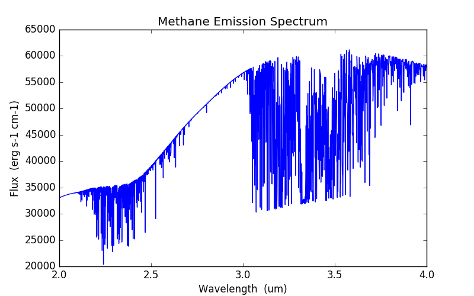

### Transit
>A radiative-transfer code for planetary atmospheres  

Transit calculates the transmission or emission spectrum of a planetary atmosphere with application to extrasolar-planet transit and eclipse observations, respectively. Transit computes the spectra by solving the one-dimensional line-by-line radiative-transfer equation for an atmospheric model.  

<a href="https://www.youtube.com/watch?v=-GHBFHyeI14" target="_blank"></a>

### Table of Contents:
* [Team Members](#team-members)
* [Getting Started](#getting-started)
* [Install and Compile](#install-and-compile)
* [Quick Example](#quick-example)
* [Be Kind](#be-kind)
* [License](#license)

### Team Members:
* [Patricio Cubillos](https://github.com/pcubillos/) (UCF) <pcubillos@fulbrightmail.org>
* Jasmina Blecic (UCF)
* Joe Harrington (UCF)
* Patricio Rojo (U. de Chile)
* [Austin J. Foster](http://aj-foster.com) (UCF)
* Madison Stemm (UCF)
* Ryan Challener (UCF)
* Andrew S. D. Foster (UCF)
* Michael D. Himes (UCF)

### Getting Started:
You can get the Transit User Manual [here](https://exosports.github.io/transit/doc/Transit_User_Manual.html).  For details about the inner workings of the code, you can find the Transit Code Manual [here](https://exosports.github.io/transit/doc/Transit_Code_Manual.html).

### Install and Compile:
To obtain the Transit code, download the latest stable version from the releases page (TBD). Alternatively, clone the repository to your local machine with the following terminal commands.  First, create a top-level directory to place the code:  
```shell
mkdir transit_demo/  
cd transit_demo/  
topdir=`pwd`
```

Clone the repository to your working directory:  
```shell
git clone --recursive https://github.com/exosports/transit transit/
```

Compile the pu and transit programs, as well as the pylineread TIPS code:  
```shell
cd $topdir/transit/
make
```

To remove the program binaries, execute:  
```shell
make clean
```

### Quick Example:

The following script quickly lets you calculate a methane emssion
spectrum between 2 and 4 um.  These instructions are mean to be executed from a Shell terminal.  To begin, follow the instructions in
the previous Section to install and compile the code.  Now,
create a working directory to place the files and execute the
programs:
```shell
cd $topdir
mkdir run/  
cd run/  
```

Download the HITRAN 2012 methane line-transition database at https://hitran.org/lbl/. Extract it:
```shell
unzip 06_hit12.zip
```

Copy the pylineread configuration file and run pylineread to make the transition-line-information (TLI) file:
```shell
cp $topdir/transit/pylineread/examples/demo/pyline_demo.cfg .  
$topdir/transit/pylineread/src/pylineread.py -c pyline_demo.cfg
```

Copy the transit configuration file and run transit to compute the spectrum:
```shell
cp $topdir/transit/transit/examples/demo/transit_demo.cfg .  
$topdir/transit/transit/transit -c transit_demo.cfg
```

To check out the results, run this Python script:
```python
import matplotlib.pyplot as plt
import sys
sys.path.append("../transit/scripts/")
import readtransit as rt
wlength, flux = rt.readspectrum("CH4_demo_spectrum.dat", 0)

plt.figure(0, (8,5))
plt.clf()
plt.title("Methane Emission Spectrum")
plt.plot(wlength, flux, "b")
plt.xlabel("Wavelength  (um)")
plt.ylabel("Flux  (erg s-1 cm-1)")
plt.show()
```

<dl >
  
</dl>


### Be Kind:
Please reference these papers if you found this module useful for your research:  

  [Harrington et al. 2022. An Open-source Bayesian Atmospheric Radiative Transfer (BART) Code. I. Design, Tests, and Application to Exoplanet HD 189733b. Planet. Sci. J. 3 80.](https://iopscience.iop.org/article/10.3847/PSJ/ac3513)

  [Cubillos et al. 2022. An Open-source Bayesian Atmospheric Radiative Transfer (BART) Code. II. The Transit Radiative Transfer Module and Retrieval of HAT-P-11b. Planet. Sci. J. 3 81.](https://iopscience.iop.org/article/10.3847/PSJ/ac348b)

  [Blecic et al. 2022. An Open-source Bayesian Atmospheric Radiative Transfer (BART) Code. III. Initialization, Atmospheric Profile Generator, Post-processing Routines. Planet. Sci. J. 3 82.](https://iopscience.iop.org/article/10.3847/PSJ/ac3515)

Thanks!


### License:

Transit, a code to solve for the radiative-transfer equation for planetary atmospheres.  

This project was completed with the support of the NASA Planetary Atmospheres Program, grant NNX12AI69G, held by Principal Investigator Joseph Harrington. Principal developers in- cluded graduate students Patricio E. Cubillos and Jasmina Blecic, programmer Madison Stemm, and undergraduate Andrew S. D. Foster. The included ’transit’ radiative transfer code is based on an earlier program of the same name written by Patricio Rojo (Univ. de Chile, Santiago) when he was a graduate student at Cornell University under Joseph Harrington.  

Copyright (C) 2015 University of Central Florida. All rights reserved.  

This is a test version only, and may not be redistributed to any third party. Please refer such requests to us. This program is distributed in the hope that it will be useful, but WITHOUT ANY WARRANTY; without even the implied warranty of MERCHANTABILITY or FITNESS FOR A PARTICULAR PURPOSE.  

Our intent is to release this software under an open-source, reproducible-research license, once the code is mature and the first research paper describing the code has been accepted for publica- tion in a peer-reviewed journal. We are committed to development in the open, and have posted this code on github.com so that others can test it and give us feedback. However, until its first pub- lication and first stable release, we do not permit others to redistribute the code in either original or modified form, nor to publish work based in whole or in part on the output of this code. By downloading, running, or modifying this code, you agree to these conditions. We do encourage sharing any modifications with us and discussing them openly.  

We welcome your feedback, but do not guarantee support. Please send feedback or inquiries to:  
Patricio Cubillos <pcubillos[at]fulbrightmail.org>  
Jasmina Blecic <jasmina[at]physics.ucf.edu>  
Joseph Harrington <jh[at]physics.ucf.edu>  

or alternatively,  
Joseph Harrington, Patricio Cubillos, and Jasmina Blecic  
UCF PSB 441  
4111 Libra Drive  
Orlando, FL 32816-2385  
USA  

Thank you for using transit!

